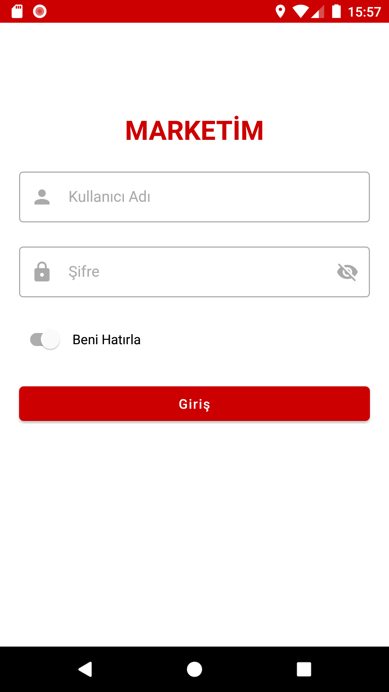
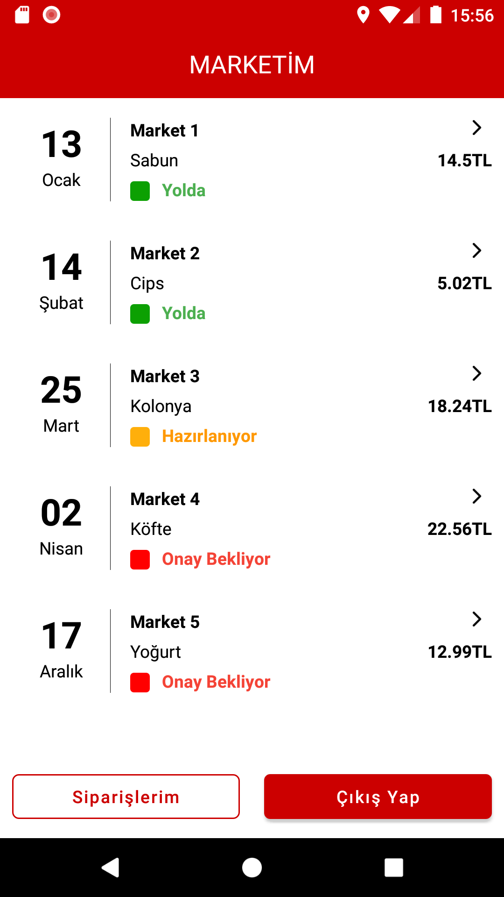
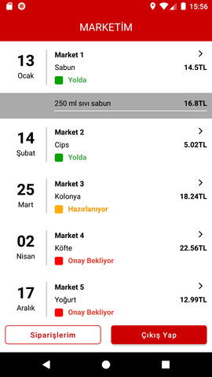
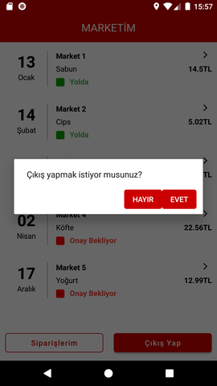

# Marketim
 
-

Bu projede;

- Kotlin
- ModelView-ViewModel(MVVM)
- DataBinding
- LiveData
- Retrofit
- Metarial Design

kullanılmıştır.

-

Uygulama ekran görüntüleri;

 
-

###İletişim
Merve Yolcu - merveylcu@gmail.com